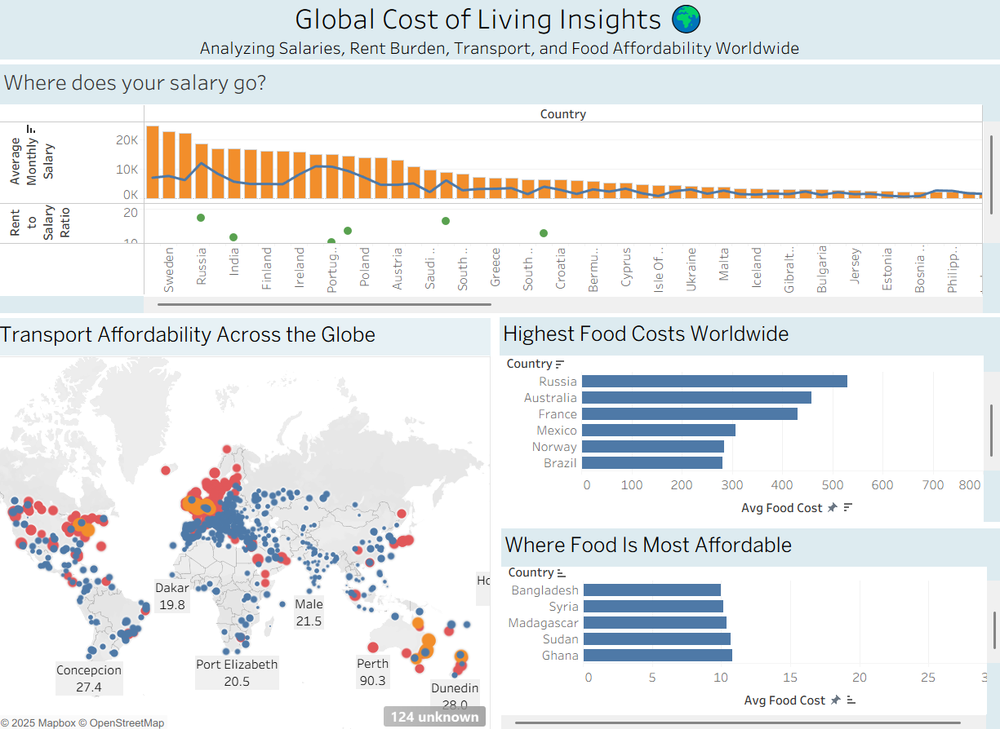

# 🌍 Global Cost of Living Insights

This interactive Tableau dashboard analyzes salaries, rent burden, transport affordability and food prices across countries worldwide.

## 📊 Dashboard Highlights

- **Where does your salary go?**  
  Compares monthly salary vs rent and food expenses.

- **Transport Affordability Across the Globe**  
  A map showing affordability based on average transportation cost.

- **Highest and Most Affordable Food Costs**  
  Countries with the most and least expensive average food prices.

## 🖼️ Screenshot Preview

## 🌐 View the Full Interactive Dashboard

👉 [Click here to open it on Tableau Public](https://public.tableau.com/app/profile/hima.deepika.mannam/viz/GlobalCostofLivingInsights_17542477495420/GlobalCostofLivingInsights)

---

## 🛠 Tools Used
- Tableau Public
- Global cost of living dataset (from Kaggle)

